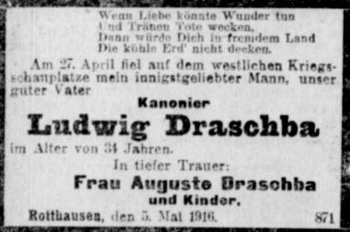

# Ollama Image Transcriptor

Dieses Projekt wurde entwickelt, um eine große Menge an Traueranzeigen aus Zeitungen für die genealogische Forschung automatisiert zu transkribieren.


Das Programm selbst wurde mit Hilfe von verschiedenen KI-Chatbots entwickelt und anschließend im Detail manuell minimal angepasst. Den Prompt für die Programmgenerierung findet man unter [generate_program.md](prompts/generate_program.md).

#### Es erfüllt dabei folgende Grundfunktionen:

1. Der Ordner **Input** wird nach Bilddateien im jpg- oder png-Format durchsucht.
2. Für jedes Bild wird ein REST-API-Post-Request als Payload zusammengestellt. Die Bilddaten werden dafür base64-encoded.
3. Der Text für den Prompt ist im Programm als Variable hinterlegt.
4. Der REST-Request wird an einen Ollama-Server übermittelt.
5. Die Response wird als JSON-Struktur entgegengenommen. Das Bild und die JSON-Daten aus der Response werden im Ordner **Output** abgelegt.
6. Für jedes einzelne Bild wird die Dauer der Verarbeitung gemessen. Und die Gesamtdauer der Verarbeitung ermittelt.
7. Der Status sowie die Dauer der Verarbeitung des Bildes wird zusätzlich in einer CSV-Datei im Projektordner erfasst.


## 1. Voraussetzungen für das Python Programm

Das Programm wurde unter Ubuntu Linux 24.04 LTS entwickelt. Man benötigt eine aktuelle Python Umgebung mit **pip** und virtuellem Environment **venv**. Diese kann mit

```bash
sudo apt install python3-pip python3-venv
```

nachinstallieren sofern sie noch nicht vorhanden ist.

### Installation und Aktivierung der virtuellen Python Umgebung

Es gehört zur guten handwerklichen Praxis ein virtuelles Environment für Python anzulegen. Dort hinein werden die zusätzlich erforderlichen Python Pakate für das Projekt installiert. 

```bash
python3 -m venv venv
source venv/bin/activate
pip install -r requirements.txt
```

Damit ist das Python Programm einsatzbereit und kann mit 
```bash
python3 transcriptor.py
```
gestartet werden. Diese Schritte können jederzeit auch auf Windows oder Mac Systemen vollzogen werden. Entsprechende Anleitungen finden sich im Internet. Der Transkriptor benötigt selbst keine Softwareabhängigkeiten zu einer KI-Installation, da er nur die Rest-Requests an die KI-Umgebung weiterleitet. 

Standardmäßig verbindet er sich jedoch mit einem lokal laufenden Ollama System unter http://localhost:11434. 
Man kann über die Umgebungsvariable 'OLLAMA_SERVER' jederzeit einen externen ollama Server einbinden. Zum Beispiel:
```bash
export OLLAMA_SERVER="http://mein-ki-server.somewhere.com:11434"
```

### Einrichten und Start des Ollama KI-Servers

Es gibt verschiedene Methoden einen Ollama Server lokal oder auf einem dedizierten Rechner zu installieren und zu starten. Die Umgebung sollte jedoch auf eine KI-fähige GPU mit 16GB VRAM zugreifen können. Verschiedene Methoden und Alternativen finden sich in der Dokumentation auf der [Ollama Homepage](https://docs.ollama.com/).

Ich verwende einen lokalen Ollama Server in einem Docker-Container. Die Docker-Host-Umgebung wurde mit einer Umgebung für den Betrieb mit einer NVIDIA RTX4080 Grafikkarte konvektioniert und getestet. Ist diese Umgebung fehlerfrei eingerichtet kann der Ollama Server lokal einfach über die [docker-compose.yml](docker-compose.yml) Datei gestartet werden:

* Laden oder Aktualisieren des Docker Images: 
  ```bash 
  sudo docker compose pull
  ```
* Start des Containers: 
  ```bash
  sudo docker compose up -d
  ```

### KI-Modell *'ministral-3:14b'* laden und testen:

Der Transkriptor verwendet das Modell [ministral-3:14b](https://ollama.com/library/ministral-3) um die Bilddateien zu transkribieren und die Daten zu generieren. Dieses Modell kann jederzeit im Quellcode gegen ein anderes ausgetauscht werden. Das zu verwendende KI-Modell muss allerdings auf den Ollama-Server geladen werden. Hierfür liegt im Projektordner ein [Shell-Script](ollama.sh) bereit:

```bash
./ollama.sh pull ministral-3:14b
```
die verfügbaren KI-Modelle des Ollama-Servers kann man jederzeit anzeigen lassen:
```bash
./ollama.sh list
```

Ob der Ollama Server fehlerfrei läuft und auf die Rest-API regiert kann mit einer einfachen Chatanfrage getestet werden:

```bash
curl http://localhost:11434/api/generate -d '{
  "model": "ministral-3:14b",
  "prompt": "Warum ist der Himmel blau?",
  "stream": false
}'
```

Statt **ministral-3:14b** können auch andere Modelle verwendet werden. Eine Auswahl möglicher Modelle ist im [Ollama Repository](https://ollama.com/search) einsehbar. Für die Transkriptionsaufgabe sollten die Modelle jedoch idealerweise

* einen Kontext von **256k** Token verarbeiten können
* und **visionfähig** sein.

Solche Modelle wären auch aus den Serien
* [qwen-3.5](https://ollama.com/library/qwen3.5)
* [qwen-3.6](https://ollama.com/library/qwen3.6)
* [qwen-3-vl](https://ollama.com/library/qwen3-vl)
* [gemma4](https://ollama.com/library/gemma4)
* ... und alle neueren Vision-Modelle

einsetzbar. Je größer die Modelle sind, umso bessere Ergebnisse sind zu erwarten. Sie sollten nur zur verfügbaren GPU-Kapazität der KI-Hardware / Grafikkarte passen. 

Die Transkriptionsqualität ist extrem stark abhängig vom Prompt und dem eingesetzten KI-Modell und natürlich der Bildqualität. Alle Bedingungen müssen fein aufeinander abgestimmt werden. Zu große Bilddateien werden allerdings das mögliche Kontextfenster überschreiten. Der Text im Bild sollte für das Modell gut lesbar sein. Moderne Schirften werden besser erkannt als sehr alte. Handschriften wurden bisher gar nicht berücksichtigt oder getestet.

---

## Beispiel für eine Transkription:

Die Traueranzeige des Ludwig Draschba

 

 wird trotz sehr mangelhafter und grenzwertiger Bildqualität und zu kleiner Bildgröße wie folgt transkribiert. Bemerkenswert ist dabei, dass das Sterbedatum und der Sterbeort direkt aus dem Text interpretiert werden. Die Dauer für die Transkription beträgt auf der NVidia RTX4080 GPU Hardware 6.86 Sekunden.

````json
{
  "Volltext": "Wenn Liebe könnte Wunder tun und Tränen Töte wecken, Dann würde Dich in fremdem Land die kühle Erd' nicht decken. Am 27. April im Alter von 34 Jahren in tiefer Trauer: Kanonier Ludwig Draschba. In tiefer Trauer: Frau Auguste Draschba und Kinder.",

  "Vorname": "Ludwig",
  "Nachname": "Draschba",
  "Geburtsname": "",

  "Geburtsdatum": "",
  "Geburtsort": "",

  "Sterbedatum": "27. April 1918",
  "Sterbeort": "westlicher Kriegsschauplatz",

  "Trauernde": [
    "Frau Auguste Draschba",
    "Kinder"
  ],

  "Beisetzung": "",

  "Grafik": "Die Anzeige enthält eine klassische, gedruckte Schrift in serifenbetonter Schriftart. Der Text ist zentral ausgerichtet und in einem typischen Stil für Traueranzeigen des frühen 20. Jahrhunderts gestaltet. Die Schrift ist schwarz auf hellem Hintergrund.",

  "Hintergrund": "",

  "Bemerkungen": "Die Anzeige enthält ein Zitat in Gedichtform, das den Verlust betont. Die Angabe 'Kanonier' deutet auf eine militärische Stellung im Ersten Weltkrieg hin. Der Ort 'westlicher Kriegsschauplatz' bezieht sich auf die Westfront des Ersten Weltkriegs."
}
````

